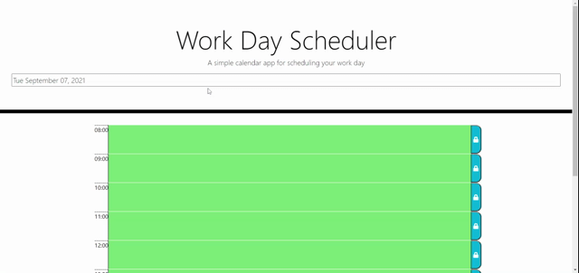

# Day Planner

This application allows the user to create hour-long appointments and save the results in local storage.  The application uses the moment() function to check the current time of day and color code the time slots for easy use.

[GitHub Repo - Day Planner](https://github.com/steven-sosebee/day-planner)

[Live Version](https://steven-sosebee.github.io/day-planner/)

## To save a new meeting:
- Click into the time-slot to type your meeting name
- Click the blue button on the right to save the meeting in the calendar




## Code used:
- The timing functions utilize moment.js for time comparisons and formatting
- Jquery is used to populate the time-slots on refresh


```
function createCalendar() {
    console.log("createCalendar");
    var workingHours = moment.duration(endTime.diff(startTime)).asHours();
    for (var i = 0; i < workingHours; i++) {
        var timeBlock = $("<li data-hour='' class='row time-block d-flex justify-content-between'>");
        var saveBtn = $("<button class='saveBtn ml-auto'>");
        var timeLabel = $("<div class='hour'>");
        var meetingLabel = $("<input class='textarea'>")
        saveBtn.attr("id", "saveBtn-" + i);
        saveBtn.append("<i class='fas fa-lock'></i>");
        var timeColor;
        var displayTime = moment(startTime).add(i, "hours").format("HH:mm");
        var hour = moment(startTime).add(i, "hours").format("HH:mm");
        timeBlock.attr("id", "hour-" + i);
        timeBlock.attr("data-hour", hour);
        timeBlock.append(timeLabel);
        timeBlock.append(meetingLabel);
        timeBlock.append(saveBtn);
        timeColor = colorCode(hour);
        timeBlock.addClass(timeColor);
        timeLabel.text(displayTime);
        dayEl.append(timeBlock);        
        dayEl.attr("id", "day");
    };
};
```

```
function colorCode(time, date) {
    // if (date < currentTime.format("dd/mm/yyyy")) {
        
    // }
    if (time < currentTime.format("HH:00")) {
        return "past";
    } else {
        if (time > currentTime.format("HH:00")) {
            return "future";
        } else {
            return "present";
        };
    }
}
```

```
 .past {
    background-color: #d3d3d3;
    color: white;
  }
  
  .present {
    background-color: #ff6961;
    color: white;
  }
  
  .future {
    background-color: #77dd77;
    color: white;
  }
  ```